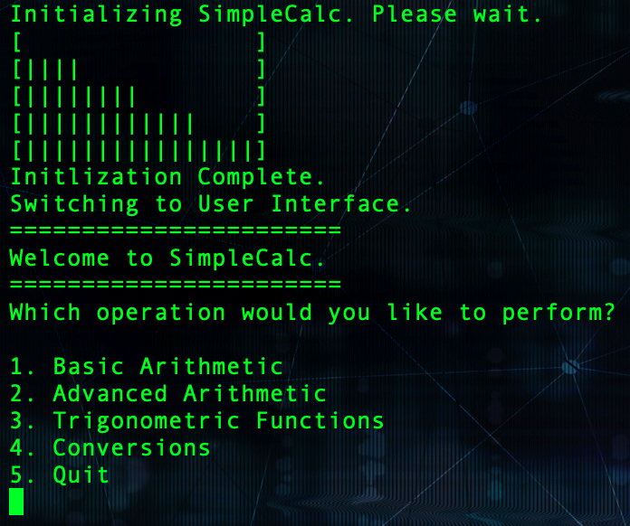
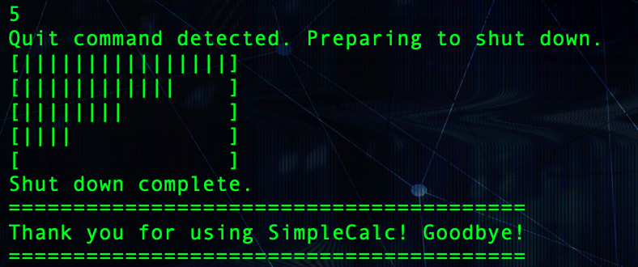

# CS 100 Programming Project

## Project Proposal

### Group Members
Elbert Nguyen, enguy054@ucr.edu  
Franz Ignacio, figna002@ucr.edu  
Ken Lee, klee229@ucr.edu 
 
### Project title
SimpleCalc will be the title of our project.

### What application do you plan to work on?
Our team is working on a calculator framework. Other developers can take this basic framework and enhance on its functionality to be able to implement it in their own projects.

### Why is it important and interesting?
Code portability is a key fundamental in software development. We want to demonstrate the importance of this fundamental by creating a framework that other developers can implement into their own project and enhance its functionality. 

### What language/tools/technology do you plan on using?
We will be coding this calculator in C++.

### Input/output of the project?
- Input: Two numbers and a choice of computation (addition/subtraction/division/multiplicaton/etc.)
- Output: The result from the computation

## Design Patterns
### Decorator Pattern

This Pattern is optimized for adding additional functionality to our existing calculator. 
Our existing calculator is able to perform standard operations on user provided operands. 
Using a getEvaluate() function, we are able to get the result. The Decorator Pattern specializes in it's ability to wrap around a base class to add additional features. This way, we prevent a class explosion and are able to implement these functions more efficiently. With an abstract AdditionalFeatures component, we are able to add conversions into the mix. 
We can convert the answer into Radians or convert the answer into Degrees. We can also add trigonometric functionality using sine, cosine, tangent, arcsine, arccosine, and arctangent.

### Composite Pattern

This pattern was used in order to create the basic functionality for the class by using leaves and composites. I was able to implement the basic operations and two more advanced operations while using the implemented evaluate and print functions. As a result, I was able to implement the basic functionality and thus created the basis for our basic calculator.
Alongside that, we will have an abstract evaluate component so that we can implement more functions if needed.

### Factory Pattern

The factory pattern diagram (above) demonstrates the final expected functionality of our application.
Once the application loads up, it begins to take input from user.
Function getInput() checks the inputs from user to determine if it's valid, and performs numerous checks from there to call and calculate.
The display() function outputs the equation user inputs, then outputs answer.

## Final deliverable

### Design Pattern breakdown
#### Composite
The implementation of the composite pattern was rather quick and without too many glaring issues. The main sources came from the disconnect between the header and implementation files. A simple mistake resulted in almost three hours of debugging when the wrong return value was in the header file compared to the implementation file. Past that, the composite pattern mainly detailed the very basic functions that the program needed to run. It implemented the four basic math operations as well as a power and modulo function that all work with double values. The implementation has two basic forms. A double value and a single value input. The double values are used for a completely new equation with a brand new answer. This should be the first thing used since the saved answer is initialized to zero. Otherwise, it uses the single value variation which uses the saved answer and the numerical input to compute the results. Past that, the evaluate function is used to return the actual answer while the print function displays the full equation and its answer in an easy to read format.

#### Decorator
The decorator pattern’s purpose is to ensure more efficient coding when dealing with the implementation of additional features. Normally, without this design pattern, there could be a class explosion in which a new class with separate implementations is required for each and every single new additional feature. Instead, utilizing this design pattern, we were able to consolidate all these additional features into one that wraps around the base class. For instance, our final project is centered around a calculator, in order to implement more advanced features such as converting a value to and fro degrees and radians and all six of the trigonometric operations, we can just implement one decorator class to handle them instead of creating up to eight different classes with each needing their own implementation.

#### Factory
The factory pattern was the final piece to tie everything together. Since the project was designed to be user-interactive, we used factory pattern to implement the user interface. This turned out to be simpler than originally thought, though this did require some modification in implementation of the decorators. For the user interface, a menu was ultimately decided upon as we felt it would be the easiest for the end user to understand. The menu would allow user to choose between 4 different categories of mathematical operations (basic/advanced arithmetic, trigonometric functions, conversions), to which they would then choose a specific operation to perform.

### Final product
#### Loading sequence

#### Menu

#### Shutdown sequence

